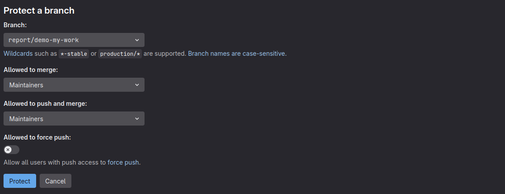
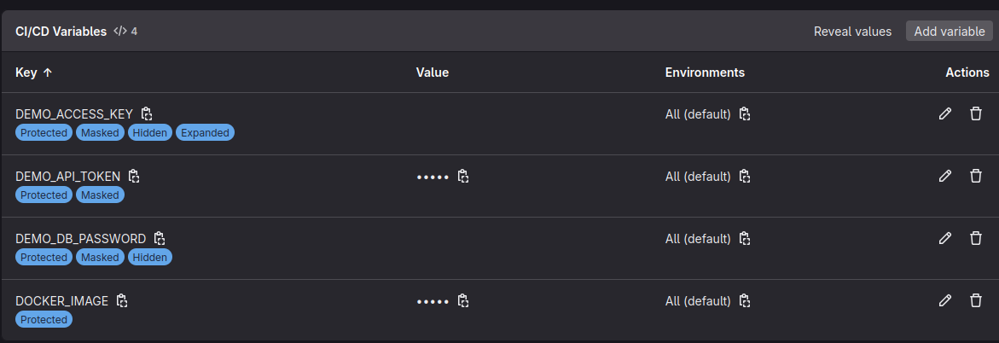
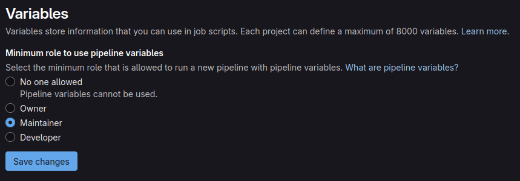
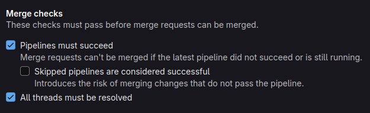
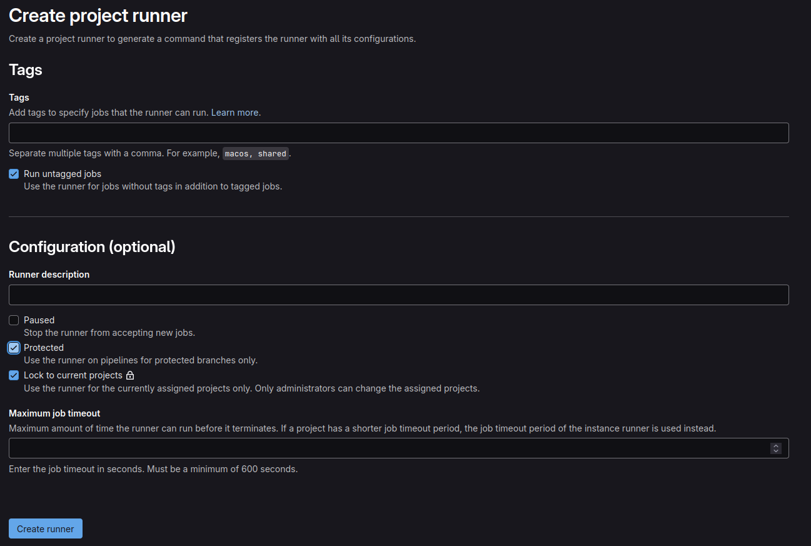
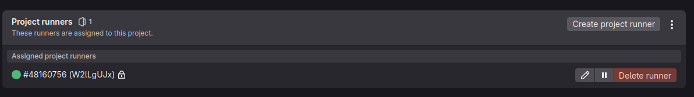
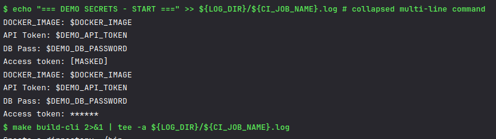
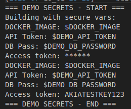
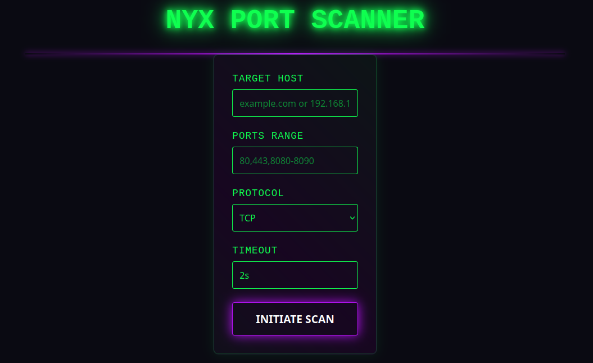
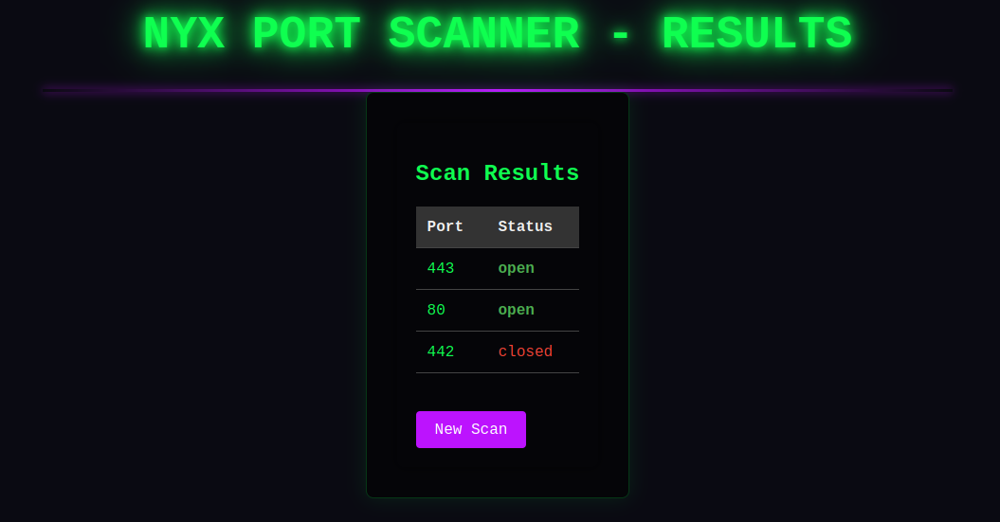

# Отчёт по выполнению задания: Настройка безопасного пайплайна GitLab CI/CD

## Обзор проекта

__Nyx__ - портовый сканер на Go c:
- CLI-интерфейсом для командного использования;
- Web-интерфейсом для визуализации результатов;
- Модульной архитектурой (ядро, парсер, вывод);

[Подробнее о структуре проекта ниже.](#Nyx---Simple-Port-Scanner-in-Go)

__Pipeline__ находится в корне проекта [ссылка.](.gitlab-ci.yml)

## Реализованный CI/CD pipeline

### Чек-лист

| Этап | Команды | Артефакты |
|------|---------|-----------|
| **Build** | `make build-cli`, `make build-server` | Логи билда (также раньше хранились бинарники) |
| **Test** | `make test` | Логи тестов |
| **Deploy** (manual) | Запуск сервера + `curl`-проверка | Логи деплоя |
---

### Контекст

#### Умные триггеры:

Pipeline срабатывает только при мердже какой-либо ветки или при коммитах в `main` ветку на этапах `build` и `test`. В `deploy` триггер срабатывает только при коммите в `main` ветку([см. реализацию ветки `main`](https://gitlab.com/ere6u5/nyx)).

```yaml
# build, test
rules:
  - if: $CI_PIPELINE_SOURCE == "merge_request_event"
  - if: $CI_COMMIT_BRANCH == "main"

# deploy
rules:
  - if: $CI_COMMIT_BRANCH == "main"
        when: manual
```
> `when: manual`  позволяет деплоить одним нажатием кнопки

> В ветке `report/demo-my-work` сделано ряд допущений для дополнительного тестирования, как например дополнительные условия:
```yaml
- if: $CI_COMMIT_BRANCH == "report/demo-my-work"
  when: on_success
```

#### Логирование:

Все логи пишутся в дирректорию `$LOG_DIR` с метками времени для дальнейшего форензик анализа при инцидентах

#### Отказоустойчивость
Чтобы не зацикливать `pipeline` в вечном цикле. Если не получаем ответ от `runner`'а в течении 10 минут - то обрываем исполнение:

```yaml
default:
  image: ${DOCKER_IMAGE}

  interruptible: true
  timeout: 10m
```

#### Использование шаблонов:

Чтобы не плодить лишние сущности - были написаны два шаблона:

Встраивается в стандартный `job` для обеспечения логирования:

```yaml
.default_settings: &default_settings
...
```

Проверка прав на деплой у выгружающего код:
```yaml
.check_access: &check_access
...
```

## Реализованные меры безопасности

### Чек-лист

| Мера | Реализация |
|------|------------|
| **Защита веток** | `report/demo-my-work` добавлена в `Protected Branches`, а также дополнительные параметры для `merge reguest` |
| **Защита переменных** | `Protected`, `Masked`, `Hidden` для секретов |
| **Ролевой доступ** | Доступ к переменным окружения есть только у `maintainer` |
| **Контроль доступа** | Проверка ролей в исполняемой единице `.check_access` |
| **Контроль деплоя** | В `stage: deploy` использовался `when: manual`. Также перед выгрузкой коммита он должен сначала пройти `pipeline`'ы |
| **Маскировка логов** | Функция `sanitize_log` + *GitLab* Masked Variables |
| **Очистка артефактов** | Автоудаление логов через `expire_in: 1 week` |
---

### Контекст

#### Защита веток

Для тестирования функций *GitLab* была создана `Protected` ветка:




#### Защита переменных

Также были добавлены перемменные с различными флагами `Protected`, `Masked`, `Hidden`, `Explain` для тестирования функционала:



#### Ролевой доступ

Доступ для работы с переменным окружения предоставлен `maintainer` и выше:



#### Контроль деплоя

Проверка ролей и пример вызова в конфигурации:
```yaml
# Check role
.check_access: &check_access
  before_script:
    - |
      case $CI_JOB_STAGE in
        deploy)
          if [ "$CI_DEPLOY_ACCESS_LEVEL" -lt 40 ]; then
            echo "Only maintainer can do it this"
            exit 1
          fi
          ;;
        test)
          if [ "$CI_DEPLOY_ACCESS_LEVEL" -lt 30 ]; then
            echo "Only developer can do it this"
            exit 1
          fi
          ;;
        build)
          if [ "$CI_DEPLOY_ACCESS_LEVEL" -lt 20 ]; then
            echo "Only reporter can do it this"
            exit 1
          fi
          ;;
      esac

...

build_job:
  stage: build
  <<: [*default_settings, *check_access]
```
Дополнительные параметры, чтобы перед выгрузкой в ветку - сначала проходил `pipeline`:



#### Маскировка логов и очистка артефактов

Реализован шаблон для `job`'ов с возможностью удаления артефактов. Также в этот шаблон включена функция для дополнительной фильтрации логов:
```yaml
# Logs
.default_settings: &default_settings
  before_script:
    - mkdir -p ${LOG_DIR}
    - export LOG_TIMESTAMP=$(date +"%Y-%m-%d_%H-%M-%S")

    - |
      sanitize_log() {
        sed -E "s/(${DEMO_API_TOKEN}|${DEMO_DB_PASSWORD}|${DOCKER_IMAGE}|${DEMO_ACCESS_KEY})/******/g"
      }

    - echo "[${LOG_TIMESTAMP}] === ${CI_JOB_NAME} STARTED ===" >> ${LOG_DIR}/${CI_JOB_NAME}.log
  after_script:
    - export LOG_TIMESTAMP=$(date +"%Y-%m-%d_%H-%M-%S")
    - echo "[${LOG_TIMESTAMP}] === ${CI_JOB_NAME} FINISHED ===" >> ${LOG_DIR}/${CI_JOB_NAME}.log
  artifacts:
    paths:
      - ${LOG_DIR}/
    expire_in: 1 week
    when: always
```

## Настройка GitLab Runner
Для выполнения и тестирования pipeline'ов использовался собственный runner без тегов. Дополнительно установлен флаг `Protected` для работы с `Protected` ветками:



Также его регистрация через терминал. В папке `runner-tmp` будет развёртываться проект с *gitlab'а*:

```bash
# Регистрация раннера
gitlab-runner register \
  --non-interactive \
  --url "https://gitlab.com/" \
  --executor "shell" \
  --description "Local Dev Runner" \
  --run-untagged="true" \
  --locked="true" \
  --config "$PWD/gitlab-runner-config.toml" \
  --registration-token "..."

# Настройки для успешного запуска
chmod 644 ./gitlab-runner-config.toml
mkdir runner-tmp
```

Пример конфигурации `gitlab-runner-config.toml`:
```yaml
concurrent = 1
check_interval = 0
shutdown_timeout = 0

[session_server]
  session_timeout = 1800

[[runners]]
  name = "Local Dev Runner"
  url = "https://gitlab.com/"
  id = ...
  token = "..."
  token_obtained_at = ...
  token_expires_at = ...
  executor = "shell"
  [runners.cache]
    MaxUploadedArchiveSize = 0
    [runners.cache.s3]
    [runners.cache.gcs]
    [runners.cache.azure]
```

Запуск `runner`'а:
```bash
gitlab-runner run --config "$PWD/gitlab-runner-config.toml" --working-directory "$PWD/runner-tmp"
```

Отображение `runner`'а в веб-панели:



## Защита sensitive-данных: двойное маскирование

В рамках демонстрации возможностей маскирования *GitLab CI*, в этой ветке `Protected` была реализована двухуровневая система маскирования.

Код из `.gitlab-ci.yml`:
```yaml
 # === DEMO SECRETS - START ===
  - echo "DOCKER_IMAGE: ${DOCKER_IMAGE}"
  - echo "API Token: ${DEMO_API_TOKEN}"
  - echo "DB Pass: ${DEMO_DB_PASSWORD}"
  - echo "Access token: ${DEMO_ACCESS_KEY}"
  - echo "DOCKER_IMAGE: ${DOCKER_IMAGE}" | sanitize_log
  - echo "API Token: ${DEMO_API_TOKEN}" | sanitize_log
  - echo "DB Pass: ${DEMO_DB_PASSWORD}" | sanitize_log
  - echo "Access token: ${DEMO_ACCESS_KEY}" | sanitize_log
```

Для тестирования использовались переменные с различными настройками. Исходный код сохранён в этой ветке. Более чистый код без тестирования лежит в `main` ветке:


Вывод результата с дополнительной фильтрацией и без:



Проблема: При сохранении логов в файл маскированные переменные отображаются в чистом виде. Обратиться к ментору за решением. Возможно явно прописывать в конфигурации флаги для переменных




## Вывод

В рамках задания был успешно реализован безопасный __CI/CD-пайплайн__ в GitLab, включающий этапы `build`, `test` и `deploy`. Основные моменты:

Защита sensitive-данных:

-  Использованы `Masked` и `Protected` переменные.
-  Реализована двойная маскировка логов (встроенная в *GitLab* + кастомный `sanitize_log`).
-  Ограничен доступ к переменным (`maintainer`).

Контроль доступа
- Настроены `Protected Branches` с обязательными `Merge Request` и проверкой пайплайна перед слиянием.
- Ветка `report/demo-my-work` использована для тестирования защитных механизмов.
- Ролевая проверка в `.check_access` для этапов (`deploy` — только для `maintainer`).

Надёжность пайплайна
- Умные триггеры (`merge_request_event` + `main`).
- Таймаут выполнения (`10m`) и очистка артефактов (`expire_in: 1 week`).
- Ручное подтверждение деплоя (`when: manual`).

Инфраструктура
- Развёрнут защищённый `Runner` (`Protected` + `shell`-исполнитель).
- Логирование с метками времени для аудита.

# Nyx - Simple Port Scanner in Go

**Nyx** is a dual-interface port scanning tool written in Go, offering both CLI and web-based scanning capabilities



## Features

### Core Functionality
- Concurrent port scanning engine
- Support for TCP/UDP protocols (IPv4/IPv6)
- Port range specification (e.g., 80,443,8000-9000)
- Configurable connection timeout

### CLI Interface
- JSON output for programmatic use
- Lightweight executable (<5MB)
- Pipeline-friendly output

### Web Interface
- Browser-based scanning interface
- Responsive design
- Interactive results display
- Form-based configuration


## Installation

### Install from Source
```bash
git clone https://github.com/ere6u5/nyx.git
git clone https://gitlab.com/ere6u5/nyx.git

```

### Using Go Install
```bash
go install github.com/ere6u5/nyx@latest
```

### Build make or task
```bash
cd nyx

# Build both components on make
make all

# Or usage task
task all

# Or build individually
make build-cli    # command-line interface
make build-server # web interface

# Or build individually on task
task build-cli    # command-line interface
task build-server # web interface
```

### Cleanup
```bash
# Usage make
make clean

# Or usage task
task clean
```

## Web Interface Usage

### Configuration Options

#### Scan Configuration
- Target Host: Enter domain name or IP address
- Ports: Specify ports/ranges (comma-separated)
- Protocol: Select TCP/UDP protocol
- Timeout: Set connection timeout (default: 2s)

#### Viewing Results

##### Results include:
- Port number
- Status (open/closed)




## CLI Usage

### Basic syntax:
```bash
nyx-cli -h <host> [-p <ports>] [-tp <protocol>] [-jf <output.json>]
```


### Options

| Flag               | Description                              | Default   |
|--------------------|------------------------------------------|-----------|
| `-h`, `--host`     | Target host (IP or domain)               | *required*|
| `-p`, `--ports`    | Ports to scan (comma-separated or range) | `80,443`  |
| `-tp`, `--type-protocol` | Protocol type (tcp/udp)            | `tcp`     |
| `-jf`, `--json-file`	| Save results to JSON file	            | `- `      |
| `-to`, `--timeout` 	|Connection timeout (e.g. 500ms, 2s)	| `2s`      |

## Supported Protocols
- tcp, tcp4 (IPv4-only), tcp6 (IPv6-only)
- udp, udp4 (IPv4-only), udp6 (IPv6-only)
- ip, ip4 (IPv4-only), ip6 (IPv6-only)
- unix, unixgram, unixpacket

## Examples

Basic scan
```bash
nyx-cli -h example.com -p 22,80,443
```

Scan common ports on example.com:
```bash
nyx -h example.com
```

Scan specific ports with UDP protocol:
```bash
nyx -h example.com -p 53,123 -tp udp
```

Scan a port range and save to JSON:
```bash
nyx -h example.com -p 8000-9000 -jf results.json
```

Scan usage all flags:
```bash
nyx-cli -h 192.168.1.1 -p 1-1024 -tp tcp -to 1s -jf results.json
```

## Output Example
Standard output:
```bash
Starting Nyx 0.0.1
Scanning example.com (tcp)
80 - open
443 - open
8080 - closed
9000 - closed
```
JSON output (when using -jf):
```json
[
  {
    "port": 80,
    "status": "open"
  },
  {
    "port": 443,
    "status": "open"
  },
  {
    "port": 8080,
    "status": "closed"
  }
]
```

## License
This project is licensed under the MIT License - see the [LICENSE](LICENSE) file for details.

Copyright © 2025 github.com/ere6u5